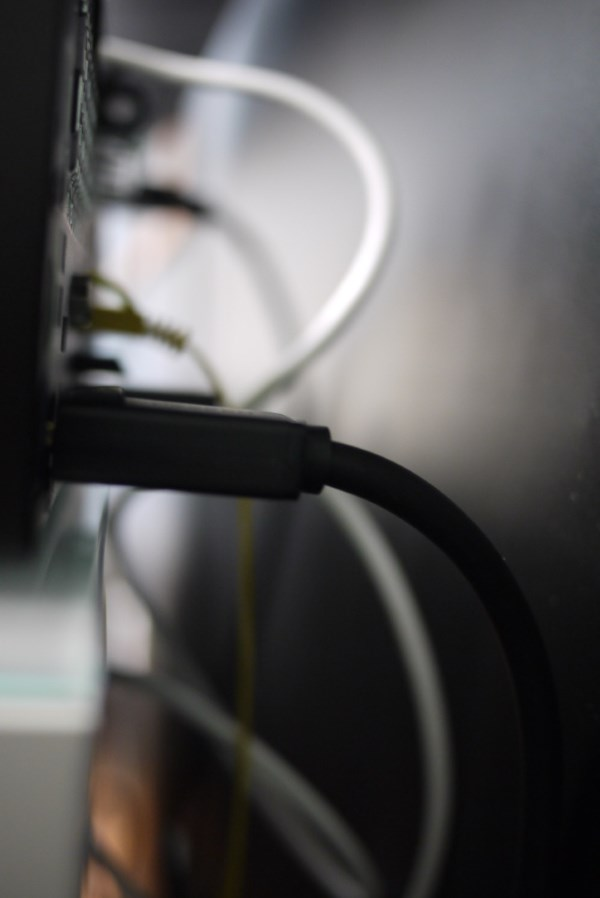
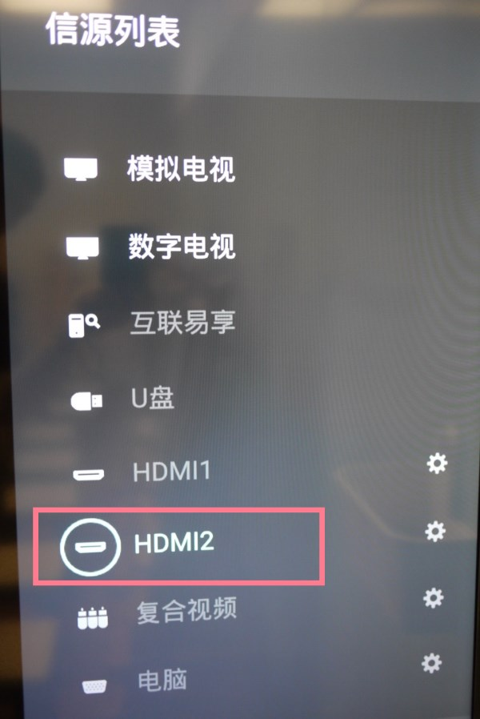
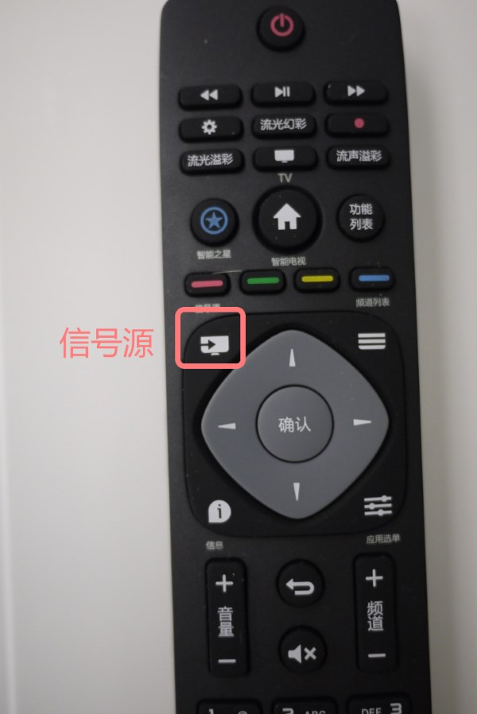
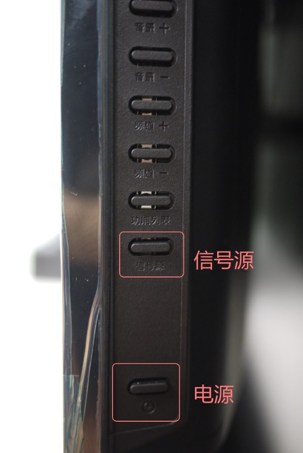
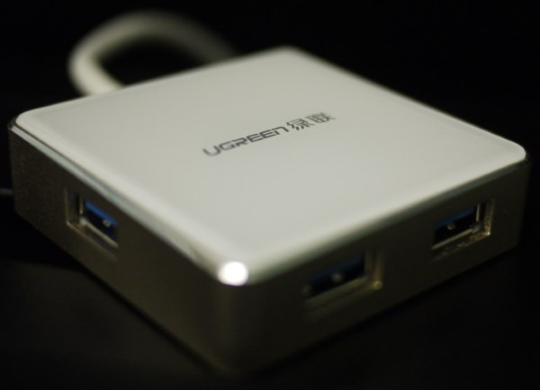
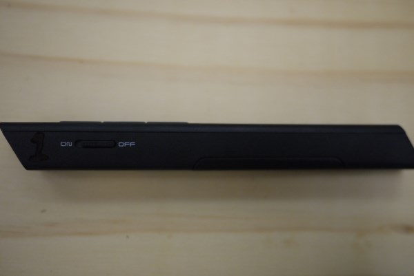
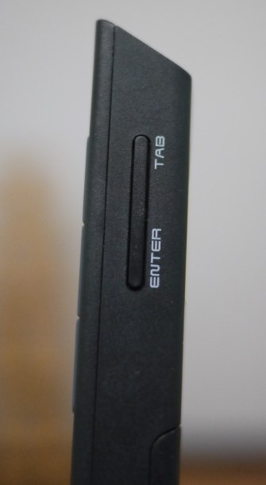
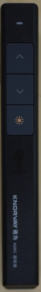

# 古北校区使用电脑连接电视教学注意事项

## 电视柜
* 电视柜距离墙不要太近，留有一定空间
  * 电脑散热风扇不能紧贴墙
  * 电源线，视频线(DP)线弯曲只能到一定角度，挤压容易造成损坏
    

## 电视机
* 电视机只是作为显示器使用，连接电脑
  * 视频输入源：**HDMI 2**

    

  * 如果输入源误操作，可以使用如下方法来恢复：
     * 使用遥控器

       
     
     * 使用电视机右侧按钮（底部开始往上，倒数第2个就是信号源）

       

* 最后一节课使用完毕后，请及时关闭电视机电源（进入待机）
  * 不管使用遥控器或者电视机右侧按钮（最底部按钮）关闭，都是进入待机模式

## 电脑
* 使用USB Hub来连接USB设备
  * 电脑前面板已经和桌面对齐。USB口插入U盘等设备，向前突出，易碰撞
  * 前面板的USB口如果损坏后，修理不易

      

## PPT翻页笔
* 型号
  * 诺为（KNORVAY）N26C 超链接版

    
    
    
* 基本操作
  * 单按`Tab`，选择超链接
  * 单按`Enter`，打开超链接
  * 长按`Enter`，关闭当前窗口
  * 长按`Tab`，切换已经打开的窗口
* 不要使用激光
  * 红点在电视机上显示不明显
  * 有伤害幼儿学生潜在风险
