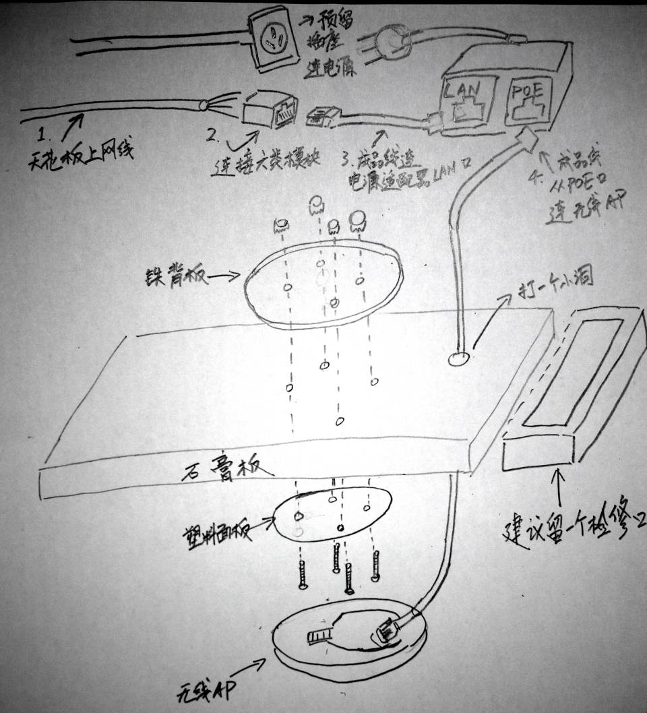

# 古北校区网络设计规划

#### 布线
* 使用六类线（施工方已经购买秋叶原六类线）

#### 网络模块以及面板
* 使用六类网络模块
  * 建议采购[康普六类模块（原AMP）,京东价格29元](https://item.jd.com/152667.html)
* 购买不带网络模块的面板(和模块同品牌)
* 如果面板是双口（1个网口，1个电话口)，还需购买电话模块

#### 网线连接至机房机柜
* 把机房的网线打到配线架上
* 网线不要做水晶头
  * 六类网线手工制作水晶头成功率低，质量难以保证。如果做不好还不如超五类。 
  * 配线架便于整理，找线。

#### 无线覆盖
* 使用UBNT的Unifi UAP + 软件AC控制器方案实现无缝漫游
* 安装方式：吸顶
  * 石膏板可能强度不够，建议按照标准吸顶安装方法
    * 放置自带铁质背板在石膏板上。
    * 塑料面板在石膏板下面，4根长螺丝，螺帽把铁质背板，石膏板，塑料面板固定住。
  * 天花板上的网线和六类模块连起来，不要做水晶头。
  * 天花板上的电线做成3眼电源插座面板，接自带的电源适配器。
  * 电源适配器LAN口与天花板上的做好的网络模块之间，使用成品跳线连接。
  * 电源适配器POE口与无线AP之间，使用成品跳线连接，需要石膏板开一个小洞。
  
    

